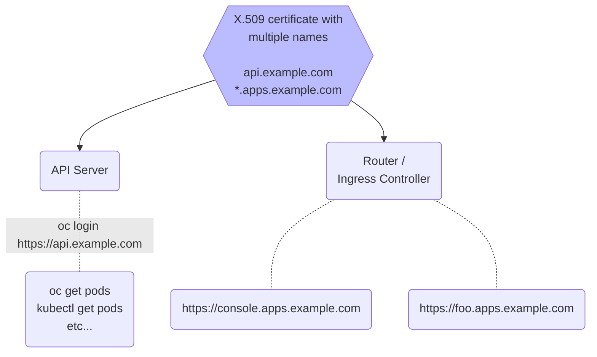

# OpenShift Certificates

OpenShift is secure by default. The installation process creates two self-signed certificates that are used to: 1) encrypt and secure the connection between users and the applications running on OpenShift 2) encrypt and secure the API endpoint used for command-line interactions (e.g. `oc apply -f myapp.yaml` and `kubectl apply -f myapp.yaml`).

Applications hosted on OpenShift, including the Web Console, can use the Router / Ingress Controller's wildcard certificate for security and encryption. The wildcard certificate allows your applications to be hosted under the `*.apps.example.com` domain. But users will most likely be uncomfortable clicking through the browser prompts asking them to trust the default self-signed certificate.

The self-signed [API](https://docs.openshift.com/container-platform/latest/security/certificates/api-server.html) and [wildcard](https://docs.openshift.com/container-platform/latest/security/certificates/replacing-default-ingress-certificate.html) certificates can be easily replaced with certificates your users will automatically trust. I've abbreviated the official OpenShift documentation into the commands below to help you quickly understand how this is done.

## Certificate overview, drivers licenses and beers :beers:

Certificates, also known as X.509 certificates, are similar to a driver's license. A driver's license has your name and photo on it as well as markings from the state that issued it. When you show your license to somebody, to buy a beer for example, they compare what you look like to the photo on the license to make sure you're not impersonating somebody else. They also look at the state's markings and decide if your license was signed by somebody they trust. If the photo doesn't match, or the person you showed your license to doesn't trust the issued it, they won't give you a beer. :cry:

Similarly, your certificate needs to include the name(s) of your website and be signed by a Certificate Authority (CA) that your users' trust. Problems arise when a website named foo.example.com shows a certificate that says it was created for bar.example.com, because the names don't match. Other problems arise if the names match but the certificate was created/signed by an untrusted CA. Its common to say that certificates were "signed" by a CA rather than "created" or "issued" by the CA. Certificates either need to be signed by a CA that your users already trust, or your users need to add the signing CA to their list of trusted CAs.

Creating a certificate requires a few details like the name(s) of the website the certificate will be used for, your company name and location, and the public part of a public/private encryption key pair. The combination of certificate details and public encryption key are called a certificate signing request (CSR). Your CSR needs to be sent to a CA where it will be reviewed. If the CA is convinced that your details are legitimate (e.g. you're not requesting a certificate for a website you don't own) they will sign your certificate request and return a certificate with their name on it stating that the certificate is valid for the websites your requested.

The links below are from Certificate Authorities that will sell you a certificate.
https://www.ssl.com/faqs/what-is-an-x-509-certificate/
https://www.digicert.com/faq/cryptography/how-does-a-public-private-key-pair-work

Certificates Authorities also exist that will sign/create your certificate for no cost.
https://letsencrypt.org/

Your company may have its own Certificate Authority that can issue certificates. Microsoft Active Directory and FreeIPA are common examples. In this case somebody from your company should have already configured your laptop to trust the certificates issued by the CA.

## One certificate instead of two

OpenShift uses two different certificates to secure its API and Router / Ingress Controller as mentioned above. An extension to the X.509 specification in May 2000 allows certificates to list multiple website names. This is similar to one driver's license having two names & photos on it, like Bruce Wayne and Tony Stark! Before the extension was created, certificates could only have one name. Instead of creating lots of individual certificates, "wildcard" certificates like `*.example.com` were used to secure multiple websites with a single certificate (and encryption key.) This would be similar to a driver's license being valid for everybody who shared a family name like Robert Parr, Helen Parr, Violet Parr, Dash Parr, and Jack-Jack Parr.

For simplicity, instead of creating two separate Certificate Signing Requests with two public/private key pairs and two copies of the company name and location data, the commands below use the Subject Alternative Name extension to create a single certificate. The Subject Alternative Name extension is also known as subjectAltName or just SAN.

:::warning
The X.509 specification uses the term "Common Name", or CN for short. The Common Name field of the certificate can only have one name. A certificate can have many Subject Alternative Names. Google Chrome stopped trusting the old Common Name field in March 2017. Google Chrome now requires certificates to list their website name in the subjectAltName fields. https://en.wikipedia.org/wiki/Subject_Alternative_Name
:::

Figure 1:
One certificate, with multiple names, securing OpenShift's API and Router / Ingress Controller




## Create a Certificate Signing Request (CSR) with subjectAltNames

The commands below creates a single certificate with multiple names for the **api** and ***.apps** endpoints. The command also creates a new public+private key pair. Two files are created, `example.com.key` is the private key which needs to be protected. `example.com.csr` is the Certificate Signing Request with the public key and names.

```bash
# Assumes the shell is Bash

# Set a variable with the cluster name (without the api. or *.apps prefix)
export CLUSTER_NAME=example.com

# Create the key pair and request in one command
openssl req -newkey rsa:4096 -nodes \
  -subj "/CN=${CLUSTER_NAME}" \
  -addext "subjectAltName=DNS:api.${CLUSTER_NAME}, DNS:*.apps.${CLUSTER_NAME}" \
  -keyout ${CLUSTER_NAME}.key \
  -out ${CLUSTER_NAME}.csr
```

Send the `example.com.csr` file that was created to your Certificate Authority for signing. Keep the `example.com.key` file safe. It contains the private encryption key which should be protected / kept secret.

## Add your Root CA to the cluster's list of trusted CAs

Adding the Certificate Authority that issued your new certificate to OpenShift's list of trusted CAs ensures that internal health checks continue to function. Internal health checks can fail if the liveness or readiness probes don't trust the new certificate's CA.

OpenShift trusts the same CAs as Red Hat Enterprise Linux. Additional CAs can be trusted by adding them to a `ConfigMap`. Concatenate multiple additional CAs into one `ConfigMap` if necessary. Only the "root CAs" are required, not "intermediate" or lower CAs.

:::warning
Trusting additional Certificate Authorities (patching the proxy/cluster object) causes new MachineConigs to be created which may may reboot the nodes in the cluster.
:::

```bash
# Create a ConfigMap from a file (Certificate Authority data should be in PEM format)
oc create configmap custom-ca --from-file=ca-bundle.crt=rootCA.pem -n openshift-config

# Tell OpenShift to trust the additional CAs listed in the ConfigMap
oc patch proxy/cluster --type=merge -p '{"spec":{"trustedCA":{"name":"custom-ca"}}}'

# Wait for the new MachineConfigPool to apply the new MachineConfig
oc wait mcp/master --for condition=updated
```

## Update the IngressController Operator's configuration

Configuring the Router / Ingress Controller to use the new *.apps.example.com wildcard certificate is done by patching the YAML of the Ingress Operator. [Additional Routers / Ingress Controllers can be created as well](https://docs.openshift.com/container-platform/4.14/networking/ingress-sharding.html). Creating additional Routers / Ingress Controllers can be helpful if you want to server applications at alternate URLs like `*.example.net` or `*.example.io`

:::info
While not strictly required, it is recommended to provide the entire chain of trust when uploading your new certificate. This means you combine the *.apps.example.com certificate and any CA certificates into one file. The certificate of *.apps.example.com must be the first certificate listed in the file, followed by any or Intermediate CAs if applicable. The last certificate in the file is the Root CA.
:::

```bash
# Combine the Intermediate and Root CAs with the *.apps.example.com certificate
cat example.com.crt intermediate.pem root.pem > example.com.crt.fullchain

# Upload the certificate+chain and private key into a Secret
oc create secret tls ingress-certificate \
  --cert=example.com.crt.fullchain --key=./example.com.key -n openshift-ingress

# Tell the OpenShift Router / Ingress Controller to use the new certificate
oc patch ingresscontroller.operator/default --type=merge \
  -p '{"spec":{"defaultCertificate": {"name": "ingress-certificate"}}}' \
  -n openshift-ingress-operator

# Wait for new Router / Ingress Controller pods will rollout in a few seconds
oc get events -w -n openshift-ingress
```

## Update the APIServer Operator's configuration

Configuring the API server to use the new api.example.com certificate is done by patching the API server's YAML manifest.

```bash
# Combine the Intermediate and Root CAs with the api.example.com certificate
cat example.com.crt intermediate.pem root.pem > example.com.crt.fullchain

# Upload the certificate+chain and private key into a Secret
oc create secret tls api-certificate \
  --cert=example.com.crt.fullchain --key=./example.com.key -n openshift-config

# Tell the API server to use the new certificate
# First, set the cluster name (without the api. prefix)
export CLUSTER_NAME=example.com

# Finally, patch the FQDN (api.example.com) and Secret name into the YAML
oc patch apiserver/cluster --type=merge \
  -p '{"spec":{"servingCerts": {"namedCertificates": [{"names": ["api.${CLUSTER_NAME}"], "servingCertificate": {"name": "api-certificate"}}]}}}'

# Wait for new API server pods will rollout in a few seconds
oc get events -w -n openshift-kube-apiserver
```

# Appendix

These are a collection of commands that I have found useful when working with certificates.

## Convert from PKCS7 (.p7b) format to PEM format

Some Certificate Authorities will return your signed certificate in PKCS7 (.p7b) format, often with the complete lists of Intermediate and Root CAs. You can convert this format into the PEM format that OpenShift requires with this command.

```
openssl pkcs7 -print_certs -in mycert.pkcs7 -out mycert.crt.fullchain
```

## Scrape a chain of trust from another website

If your Certificate Authority didn't provide you with it's own Root CA data, you can often scrape it from another site which uses certificates signed by the same CA. This only works if the certificate was uploaded with the additional CA certificates. It is best practice to configure OpenShift so that it presents the API and Router / Ingress certificate along with the chain of trust which includes all of the Intermediate and Root CA data.

```bash
# Simluate a client connection to the CA.
# Send the output through awk which sends the sanitized output to a file
openssl s_client -showcerts -connect ca.example.com:443 < /dev/null | \
awk '/BEGIN CERTIFICATE/,/END CERTIFICATE/ {print $0}' > scrape.pem

# Look at the contents of the scrape file
openssl storeutl -noout -text nachos.dota-lab.iad.redhat.com.crt.fullchain | grep -e 'Subject:' -e 'Issuer:' -e '^Certificate:'
```

## List the Certificate Authorities that Linux trusts

Linux stores its list of trusted Certificate Authorities in one very large file. For example, the list of trusted CAs on my server has created a file with over 4,000 lines! I found this command to be helpful when I needed to inspect it's contents.

```bash
awk -v cmd='openssl x509 -noout -subject' '/BEGIN/{close(cmd)};{print | cmd}' < /etc/pki/ca-trust/extracted/pem/tls-ca-bundle.pem 2>/dev/null
```

## Adding and removing Certificate Authorities to the bundle trusted by Linux


```bash
# For Red Hat Enterprise Linux and RHEL-type systems
# Copy the PEM files into the expected location and run the update command
sudo cp -v certs/lin/* /etc/pki/ca-trust/source/anchors
sudo update-ca-trust extract

# For Ubuntu and Debian-type systems
# First, make sure the files have a .crt extension!
# Then copy them into the expected location and run the update command
sudo cp foo.crt /usr/local/share/ca-certificates/foo.crt
sudo update-ca-certificates
```